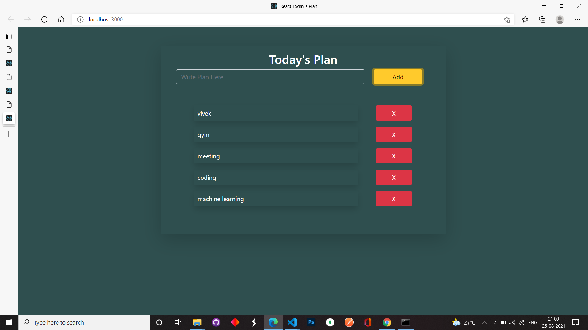
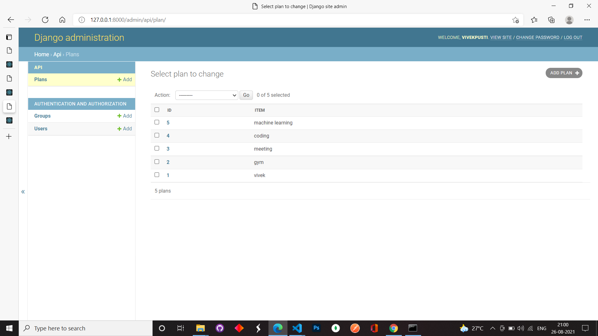
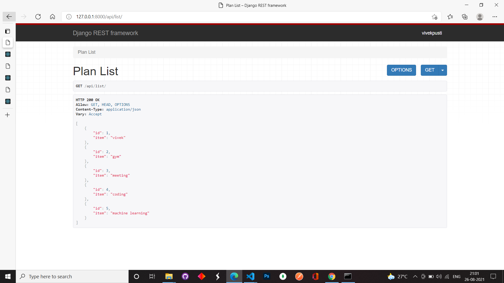

# Bucket-Plan
* I have created this with the help of react.js and django

### Screenshots how the application work in frontend and we can add task and delete from here only.

 

### Admin Panel where only admin can access the data which is entered by user.

### Django rest framework where we can see the list.crud operations can be performed

* Email- vivekpusti1999@gmail.com
* Linkedln-Vivek Pusti

